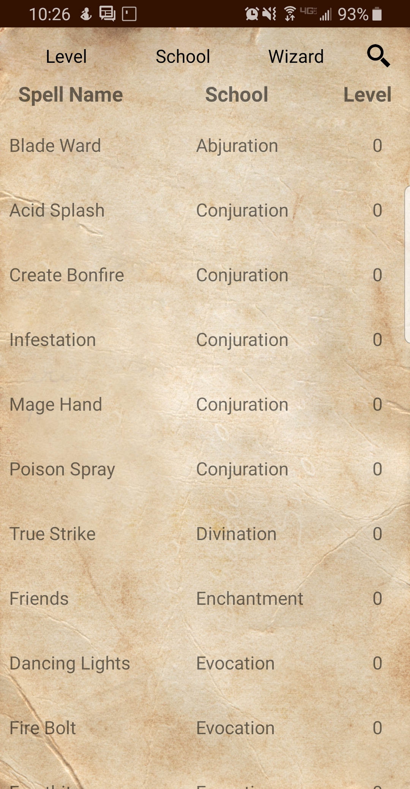
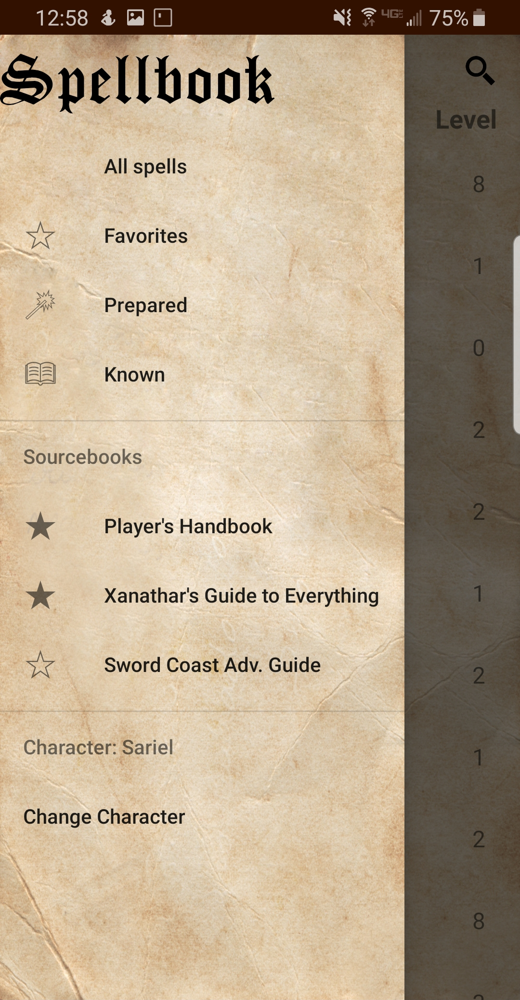
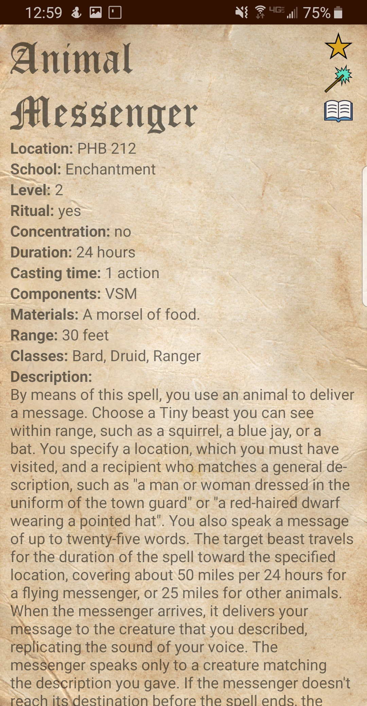
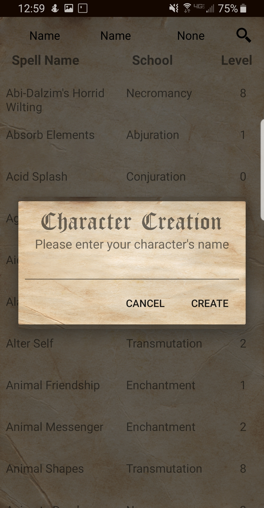
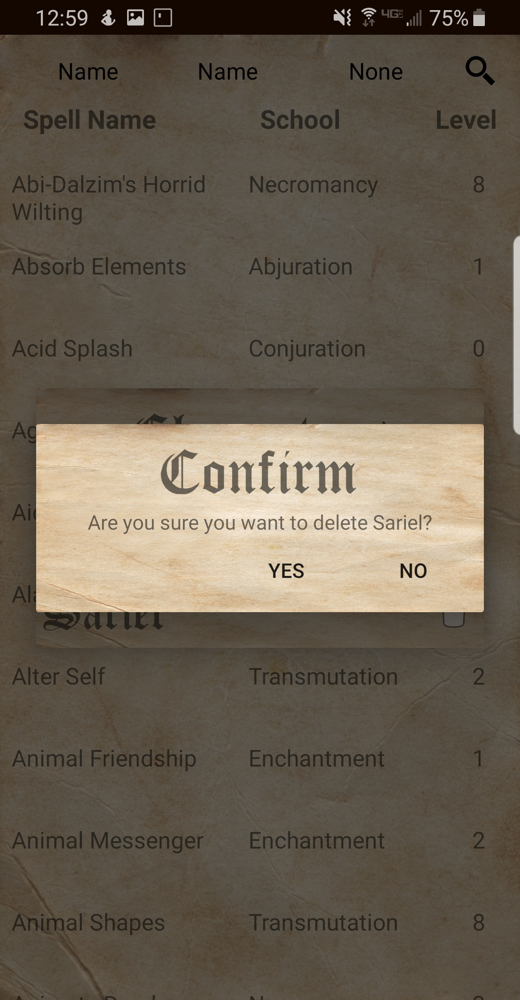

# SpellbookApp
An Android spellbook application for D&amp;D 5e. You can find the app on Google Play [here](https://play.google.com/store/apps/details?id=dnd.jon.spellbook).

## Features
Current features include:
 * Two-level sorting
 * Filter spells by class
 * Filter spells by sourcebook
 * Store multiple character profiles
 * Keep lists of favorite, known, and prepared spells for each character

## Current screenshots

